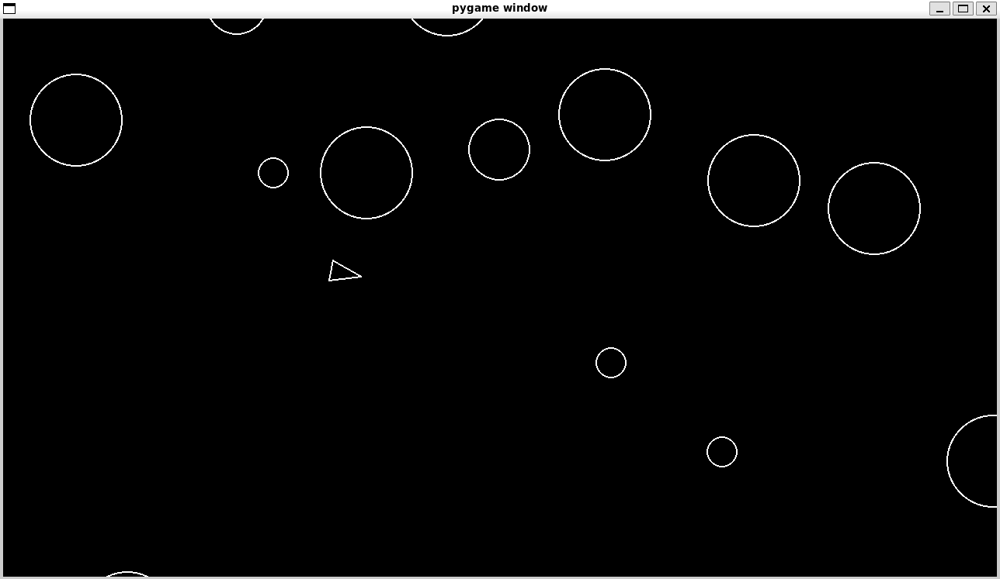

I'd be happy to help you with your `README.md`! A `README` is essential for providing context to your project, explaining what it does, and how others can contribute or run it.

Here’s a basic structure for your Asteroids game project’s `README.md`:

---

# Asteroids

My first Pygame project! Still coming to grips with GitHub and learning Pygame along the way.

  

---

## Description

A classic Asteroids-style game built using **Pygame**. The player controls a spaceship and must navigate through a field of asteroids, avoiding collisions and shooting them to score points. The game features:

- Smooth player movement and controls
- Asteroid splitting mechanics when hit by a shot
- A "Game Over" scenario when the player collides with an asteroid

---

## Installation

Follow these steps to set up and run the game on your local machine:

1. **Clone this repository**  
   ```bash
   git clone https://github.com/NadimChatellier/Asteroids
   ```

2. **Navigate to the project directory**  
   ```bash
   cd Asteroids
   ```

3. **Set up a virtual environment** (optional but recommended)  
   If you don't have a virtual environment set up already, you can create one by running:
   ```bash
   python3 -m venv venv
   ```

4. **Activate the virtual environment**  
   On macOS/Linux:
   ```bash
   source venv/bin/activate
   ```
   On Windows:
   ```bash
   venv\Scripts\activate
   ```

5. **Install dependencies**  
   Use the `requirements.txt` file to install all the necessary Python libraries:
   ```bash
   pip install -r requirements.txt
   ```

6. **Run the game**  
   Finally, to start the game:
   ```bash
   python3 main.py
   ```

---

## Controls

- **WASD** to move the player spaceship
- **Spacebar** to shoot

---

## Features

- **Asteroid collision detection**: When the player collides with an asteroid, the game ends.
- **Asteroid splitting**: When a shot hits an asteroid, it splits into smaller pieces.

---

